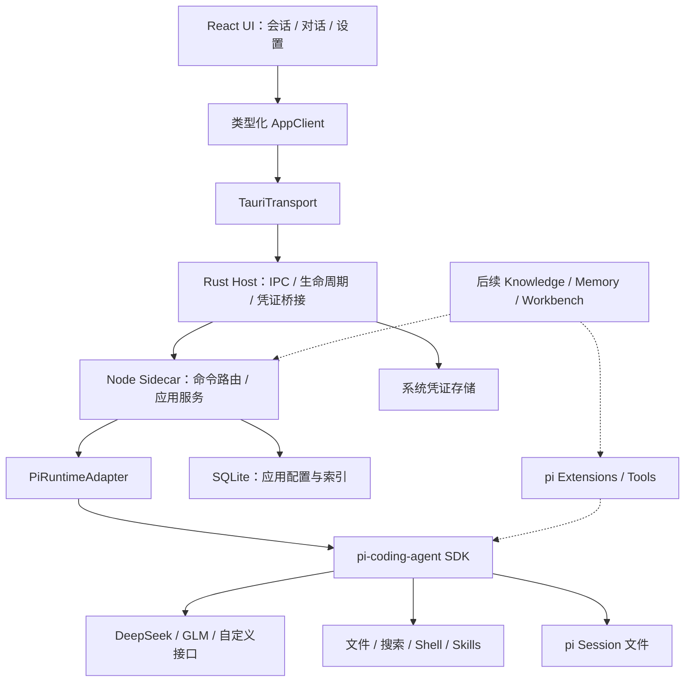

# Office Agent 技术选型与可演进架构

版本：v0.1  
日期：2026-09-11  
状态：拟采用方案；兼容性、依赖版本和发行构建须经 S0 验证。  
关联：[PRD](./prd.md) · [MVP 范围](./mvp-scope.md)

## 1. 架构目标

以最少必要基础设施交付精致的桌面 Agent，同时使未来 Knowledge、Memory、Office 工具可以独立增加。优先级依次为：真实可用、UI 完成度、可维护性、扩展速度、包体优化。

设计原则：

1. 直接使用 pi-coding-agent SDK；不 fork pi，不重写 Agent Loop、模型流或上下文压缩。
2. Rust 管桌面生命周期，TypeScript 管 Agent 集成和业务；避免同一业务在两种语言重复实现。
3. 前端不直接依赖 pi SDK、不直接操作 SQLite、不持有长期 API Key。
4. 同一种事实只有一个权威存储：pi 管会话，应用管配置，系统凭证库管密钥。
5. 抽象放在真正会变化的边界：Runtime、平台通信、凭证、业务服务。MVP 不建设通用插件平台。
6. 为 Web 保留接口，不为尚未交付的 Web 服务引入账户、多租户或网络服务。

## 2. 技术选型

以下是工程建议，不是已完成的安装或性能测试结论。实际版本在 S0 验证后写入 lockfile 与兼容记录。

| 层 | 选择 | 原因与边界 |
| --- | --- | --- |
| 桌面容器 | Tauri 2 + 少量 Rust | 原生窗口、文件选择、系统凭证桥接和子进程生命周期；前端复用 Web 技术 |
| UI | React + TypeScript + Vite | 组件化、类型检查、快速开发和前端独立构建 |
| 样式 | Tailwind CSS + CSS variables | token 驱动的深浅主题；颜色、尺寸集中维护 |
| 交互组件 | shadcn/ui | 使用可访问基础组件，二次设计而非原样拼接后台模板 |
| 动效 | CSS transition + Motion for React | 简单 hover 用 CSS；面板/图标编排按需使用 Motion |
| 图标 | Lucide | 统一线宽与尺寸 |
| 界面状态 | Zustand | 面板、选中会话、草稿、实时 run 投影；不成为历史权威存储 |
| 请求缓存 | TanStack Query | 会话列表、配置、环境检测；高频 token 不逐条进入查询缓存 |
| 协议校验 | Zod | 命令、事件、配置输入的运行时校验 |
| Markdown | react-markdown + remark-gfm | 保持代码和表格可读，默认禁用原始 HTML |
| 代码高亮 | 按需 Shiki | 限制语言包并缓存；不在每个 token 更新时全量高亮 |
| Agent | pi-coding-agent SDK | 复用会话、执行、上下文、工具与扩展接口 |
| Sidecar | esbuild 单文件 bundle + Node SEA 独立可执行，随安装包分发（2026-09-14 决策，替代"随包携带 Node"） | 用户免装 Node；动态扩展兼容性受限，以单文件自包含优先 |
| 结构化数据 | SQLite，经 repository 层访问 | 本地事务、迁移和未来 Office 数据；MVP 只建实际需要的表 |
| SQLite 驱动 | 优先验证所选 Node LTS 的 node:sqlite | 减少额外原生模块；若验证失败单独记录 ADR 并采用打包通过的替代驱动 |
| 凭证 | Rust 接系统 credential store | Windows Credential Manager / Ubuntu Secret Service；不落普通配置 |
| 工程 | pnpm workspace | 少量包边界；不在 MVP 引入大型构建编排平台 |
| 测试 | Vitest、React Testing Library、Playwright（Web UI）、平台冒烟 | Runtime 契约与真实桌面验证分开 |

Tauri 使用系统 WebView，因此需要验证 Windows WebView2 与 Linux WebKitGTK 的差异，而不能只用开发浏览器验收。[Tauri 进程模型](https://v2.tauri.app/concept/process-model/)

### 为什么当前不选其他方案

- Electron 的 Node/Chromium 集成路径值得作为备选，但当前优先沿用用户认可的 Tauri 方向；包体优势必须以包含 sidecar 的总包实测，不能只比较空壳。
- 不直接使用 pi-agent-core 从零组装：那会增加本轮明确希望复用的会话、配置和资源加载工作。
- 不采用微服务、消息队列、向量数据库、远程服务端或完整插件市场：MVP 没有对应需求。
- 不把 pi CLI 的终端画面嵌入 UI：产品需要结构化消息、工具卡片和原生配置体验。

## 3. 总体结构



图中虚线为未来模块，不在 MVP 创建空服务或未使用的数据表。

### 模块职责

| 模块 | 负责 | 不负责 |
| --- | --- | --- |
| UI | 展示、表单校验、交互、消息投影 | Agent Loop、文件执行、数据库写入 |
| AppClient / Transport | 稳定产品 API 与环境通信 | 业务规则、模型请求 |
| Rust Host | sidecar 启停、窗口退出、路径、凭证、IPC 转发 | Todo/Memory 业务、上下文逻辑 |
| Application Services | 模型配置、会话操作、单 run 调度、数据索引 | 再实现 pi 的轮次循环 |
| PiRuntimeAdapter | SDK 调用、生命周期、事件适配、资源加载 | 对外暴露整个 pi SDK 类型树 |
| Repository | SQLite 事务、迁移、查询 | 聊天 token 渲染 |

pi 官方 SDK 提供 AgentSession 及会话 Runtime 管理接口，并暴露流式和工具事件；切换/恢复会话后需要按版本要求重新绑定事件与扩展。该细节封装在适配层，不扩散到 UI。[pi SDK 文档](https://github.com/badlogic/pi-mono/blob/main/packages/coding-agent/docs/sdk.md)

## 4. SDK 与进程通信决策

选择“自有薄 sidecar + pi SDK”。pi 自带 RPC 仍是技术参考和可选替代，但 MVP 不同时维护两条 Runtime 接入路径。

理由：未来 Office 工具需要访问业务服务，SDK 便于把它们注入 pi；前端仍只依赖产品命令，因此升级 pi 不需要全局修改页面。

桌面内部使用 stdin/stdout 的 UTF-8 JSONL：一条消息以 LF 结束，stdout 只输出协议消息，日志走 stderr。Rust 分离协议与日志。pi 官方 RPC 同样采用严格 LF 帧分隔；自有协议遵循明确的帧边界，但不宣称与 pi RPC 字段兼容。[pi RPC 文档](https://github.com/badlogic/pi-mono/blob/main/packages/coding-agent/docs/rpc.md)

推荐协议包络（示意，不是 pi 原生 API）：

```ts
type Command = {
  protocolVersion: 1;
  requestId: string;
  method: string;
  params: unknown;
};

type RuntimeEvent = {
  protocolVersion: 1;
  eventId: string;
  sessionId: string;
  runId: string;
  sequence: number;
  type: string;
  payload: unknown;
};
```

命令范围：会话 list/create/open/rename/delete、run start/cancel、模型配置 list/save/delete/test、Skill reload、环境诊断。凭证写入使用单独 Rust 命令，不作为普通可记录表单载荷转发。

关键约束：

- 请求响应表示“已接受/拒绝”，run 的完成通过事件报告，不能把发送成功当作任务成功。
- 所有事件携带 sessionId/runId，防止切换会话后串消息。
- sequence 用于排序、去重；发现缺口时重新获取快照，不直接拼接未知文本。
- 协议握手校验 app/runtime/protocol 版本，不兼容时拒绝运行并给出恢复信息。
- UI 通过快照加载持久历史，再应用实时事件；Rust 暂存当前 run 的有界事件缓冲，支持短暂视图重载。
- 内存事件不保证跨进程重启重放；重启以持久 Session 为准，未完整保存的输出显示中断。
- token 增量按约 16–50 ms 批量刷新；消息结束、错误与工具完成立即送达。
- 大输出写入 artifact 文件并通过受控读取接口分段获取，禁止无限量 IPC 帧。
- 不自动重试写文件、执行命令等有副作用的应用命令。普通读取可重试；模型重试继续使用 pi 行为并观察风险。

## 5. Runtime 生命周期

MVP 一个应用实例管理一个 sidecar，一个活跃 run。历史页面不需要为每个会话启动进程。

1. Rust 启动 sidecar 并完成 ready/协议握手。
2. 服务加载非敏感配置，检测模型与 Shell，返回就绪状态。
3. 启动 run 前锁定会话、目录、模型配置版本，读取本次必要凭证并临时注入 pi。
4. pi 执行任务并持久化会话；适配器把事件转为产品投影。
5. 完成/失败/取消时释放活跃 run 锁，更新会话索引。
6. 正常退出先取消运行、等待有限时间，关闭子进程树并退出 sidecar。
7. 异常退出后扫描实际 Session；有未终结 run 时标记中断，等待用户继续。

Windows 子进程采用 Job Object 或经验证的等效进程树管理，Unix 使用进程组。取消需要覆盖 Shell 的子进程，不只是停止 UI 动画。故意脱离进程树的外部程序不承诺完全终止，这属于本地执行限制。

## 6. 模型厂商与配置设计

模型配置拆为 ProviderProfile 与 ModelProfile，预设只是表单默认值和能力建议，不把厂商逻辑写进聊天组件。

```text
ProviderProfile
  id, name, kind, protocol, baseUrl, credentialRef, revision

ModelProfile
  id, providerId, modelId, displayName,
  contextWindow?, maxOutputTokens?, capabilityOverrides?

ApplicationPreferences
  defaultModelProfileId, theme, reducedMotion
```

适配器把产品配置转换为锁定版本的 pi 模型配置。MVP 自定义接口只承诺 OpenAI Chat Completions；新增协议扩展该转换层与能力检测，不修改会话 UI。

pi 当前提供自定义 provider/model 配置、协议与兼容参数。前端只开放经过验证的参数子集；不让用户输入未经约束的任意请求覆盖对象，也不把 pi 的默认上下文长度当成真实模型规格。[pi 自定义模型文档](https://github.com/badlogic/pi-mono/blob/main/packages/coding-agent/docs/models.md)

- DeepSeek、智谱 GLM 通用 API 预设在 S0 对照官方文档核验。
- 智谱国内、Z.AI 国际、Coding Plan 分开标识，不靠相同模型名称混用端点。
- API Key 是不透明字符串，不作为 pi 配置中的命令表达式或环境插值执行。
- 自定义 base URL 正常使用 HTTPS；本地开发端点可用 localhost HTTP。发送前明确显示所选厂商与端点。
- 测试连接调用通过 pi 相同适配路径，避免“测试用一套 HTTP，实现用另一套”。
- 正在运行的任务固定使用启动时配置快照；保存配置只影响后续 run。
- 价格未知时费用显示“不可用”，而不是 0；能力未知时提供说明和测试，不伪造兼容状态。

## 7. 存储、索引与迁移

推荐应用数据结构：

```text
<app-data>/
  app.sqlite
  pi/                 # 应用专属 pi agentDir，内部格式由 pi 管理
  workspaces/default/
  skills/
  artifacts/
  logs/
  backups/
```

MVP SQLite 仅保存：非敏感厂商/模型配置、界面偏好、目录信任、会话列表索引与必要 run 状态。会话正文仍以 pi 文件为权威；列表索引必须可从会话文件和少量应用元数据重新构建。

- 会话标题、模型引用和目录映射的权威字段须在实施中明确；优先使用 pi 可持久化元数据，额外 UI 字段才放 SQLite。
- 删除由 SessionService 统一执行：先停止 run，再清理对应 Session、索引和归属 artifact；不能只删除列表行。
- 配置经 repository 统一写入；前端设置和未来 Agent 配置工具不能各自写表。
- 数据库采用版本化迁移；迁移前用 SQLite backup API 或等效一致性备份，不在 WAL 活跃时只复制主文件。
- 迁移失败保留原数据并阻止继续写入；不支持未经验证的数据库降级。
- pi 升级需用已有 Session fixture 检查兼容，保持升级前备份。
- MVP 无同步。未来同步业务资料与 Memory 时排除 Key、日志和运行中的 SQLite；使用逻辑导出或一致性快照。

不提前建 Todo/Project/Knowledge 表。后续按模块新增 schema 与迁移。

## 8. 凭证与桌面信任边界

模型 Key 由 Rust 写入系统凭证库，SQLite 只留 credentialRef。sidecar 请求当前模型必要凭证时，经受控通道获取并用于 Runtime 内存认证；不通过命令行参数、普通配置文件或日志传递。

前端提交时会短暂持有表单值，提交后清空；读取配置只返回“已配置”状态，不回显已保存密钥。若系统凭证库不可用，明确提示并允许临时内存模式，不悄悄落明文。

Tauri capabilities 约束前端能调用的宿主接口；它不自动隔离已启动 sidecar 的 Shell 或第三方扩展。MVP 使用用户本地权限执行，首次目录信任需清楚说明，不宣传为沙箱。[Tauri capabilities 文档](https://v2.tauri.app/learn/security/capabilities-for-windows-and-platforms/)

仅加载应用明确管理的本地 Skills/扩展。Markdown 禁止执行原始 HTML，外部链接经宿主打开，文件读取与 artifact 路径要验证归属。未来接入邮件和网盘时再增加外部动作权限及确认规则；当前不建设复杂权限 DSL。

## 9. Sidecar 与 Windows 分发

首选打包策略：按目标平台打包 Node 可执行文件、编译后的 sidecar、pi 运行时依赖与必须资源。通过 Tauri 的外部二进制和资源机制分发，使用绝对路径启动。Tauri 官方支持嵌入外部二进制和 Node sidecar。[外部二进制](https://v2.tauri.app/develop/sidecar/) · [Node sidecar](https://tauri.app/learn/sidecar-nodejs/)

先不强制将全部代码压成单个可执行文件：动态 Skills/扩展、资源发现、ESM 和原生依赖需要验证。若之后采用 SEA/Bun 等单文件方案，必须重新通过相同兼容套件，不能只检查“能启动”。

S0 验证清单：

1. 所选 pi 发行包、Node LTS、操作系统架构和资源路径兼容。
2. 不依赖开发机 node_modules、全局 PATH、全局 pi 或用户已有配置。
3. 动态加载一个本地 Skill 与一个基础工具扩展。
4. Windows 中文/空格安装路径和普通用户权限。
5. PowerShell 执行与取消、文件搜索、读取和写入。
6. 环境变量与运行目录明确；不把内置 Node 误当项目开发工具链。
7. 安装、卸载和覆盖升级策略清楚：默认保留用户数据，删除数据必须是显式选项。

pi 当前 Windows 文档列出可选 PowerShell 工具。具体锁定版本若不满足需求，则在 pi 工具扩展层适配 PowerShell；保持执行状态与取消语义一致。[pi Windows 文档](https://github.com/badlogic/pi-mono/blob/main/packages/coding-agent/docs/windows.md)

首版 Windows 11 x64 使用 NSIS 安装包。缺失 WebView2 时由安装流程处理并说明联网条件；完整离线安装包属于另一个分发规格。Windows 构建与验证在 Windows 环境完成，Ubuntu 开发不代表产物已兼容。[Tauri Windows 安装文档](https://v2.tauri.app/distribute/windows-installer/)

首版不做自动更新服务；覆盖安装保留数据。记录第三方许可和 SBOM/依赖清单，并在公开分发前处理签名。

## 10. 未来能力如何加入

### 10.1 Office 模块

每个模块遵循“页面 → 业务服务 → repository”，Agent 工具也调用同一业务服务。例如新增 Todo：

```text
Todo 页面 ──────────┐
                   ├─ TodoService ─ TodoRepository ─ SQLite
pi todo 工具扩展 ───┘
```

业务服务负责校验和一致性，工具负责描述参数与转换结果。这样 UI 手动新增和 Agent 新增 Todo 遵守同样规则，聊天无需内嵌 Todo 业务。

### 10.2 Knowledge / LLM Wiki

增加 SourceAdapter、本地导入任务、WikiService、来源与版本记录；Markdown 保持可导出，SQLite 保存索引。先有来源可追溯的 Wiki，再按需要引入全文或向量检索。Knowledge 通过工具提供搜索/阅读/更新，不能默认把全部内容注入系统提示词。

### 10.3 Memory

独立管理偏好、项目事实、来源、更新时间、用户编辑与删除，再通过 pi 扩展选择性加载。会话恢复不等于长期 Memory；MVP 不预先承诺 pi 有完整的自动记忆产品能力。

### 10.4 Connectors 与同步

Connector 负责厂商 OAuth/令牌刷新、分页、限流、增量游标和数据映射；业务服务不依赖具体 Gmail/Drive API。同步任务后续增加持久化状态、重试与去重，写入外部系统时增加相应授权边界。先做一条来源的单向同步，再设计多端冲突合并。

### 10.5 Web

React 使用 AppClient，未来新增 Http/WebSocketTransport，后端复用 Application Services 和 PiRuntimeAdapter。桌面文件选择、凭证和路径等通过 HostCapabilities 接口区分。

正式 Web 版仍需服务端运行 Agent 或本地伴随进程，并解决认证、执行隔离、文件访问和租户数据；“前端可复用”不意味着浏览器自动获得本地 Shell 能力。

### 10.6 调度和多会话

未来 Scheduler 从持久任务创建 run，复用执行服务。届时把当前单 run 约束扩为工作队列/多实例，并设计资源配额和工作目录冲突；MVP 不预建多 Agent 调度器。

## 11. 建议目录

```text
apps/
  desktop/
    src/                   # React 页面、组件、主题
    src-tauri/             # Rust host 与打包配置
  sidecar/
    src/                   # 入口、命令路由、服务组合
packages/
  contracts/               # 产品命令、事件、schema
  runtime-pi/              # pi SDK 适配、事件转换、工具绑定
  application/             # 会话、配置等服务与 repository
  ui/                      # 基础组件、设计 token、动效
tests/
  fixtures/                # 会话和小型测试工程
  integration/
docs/
```

初期可将小模块放在 application 内，只有出现复用或独立变化才拆包。禁止 UI 越过 contracts 引入 Runtime/数据库，禁止 runtime-pi 依赖 React。

## 12. 验证与交付流程

- 单元/契约：事件排序和取消终态、配置映射、协议校验、密钥脱敏、迁移与索引重建。
- UI：配置表单、状态卡片、滚动与草稿；Playwright 验证浏览器内界面交互，但不替代 Tauri IPC 验证。
- 集成：真实 pi + 临时工作目录，测试文件写入、搜索、工具错误、会话恢复与 Skill；mock 只用于可重复异常场景。
- 厂商：三个必测端点的真实连接、流式与工具调用；需真实凭证，未执行必须标记。
- 平台：Windows 安装包、系统凭证库、进程树取消、WebView2、覆盖升级；Ubuntu 冒烟和视觉差异。
- 视觉：核心状态截图、深浅主题、缩放、键盘/reduced motion 人工验收，不靠截图存在就判定合格。

CI 初期包含 lint/typecheck/unit/build 和 Windows 打包；真实模型测试作为具备凭证的受控任务，不对每次提交无条件调用付费接口。

## 13. 主要风险与应对

| 风险 | 应对与验证出口 |
| --- | --- |
| pi API/包名演进 | 当前文档示例使用 @earendil-works/pi-coding-agent；旧资料常见旧 scope。以实际发行包锁定版本，适配器隔离升级，记录兼容测试 |
| 动态资源漏打包 | 安装产物中验证 Skill/扩展与工具；不得依赖源码目录 |
| Shell 跨平台差异 | 默认按 OS 适配；Windows 独立验收路径和取消 |
| 模型兼容差异 | 表单预设与能力分开；三端点真实工具往返 |
| 会话与索引不一致 | pi 为权威，索引可重建，删除与迁移统一入口 |
| 视觉在两个 WebView 不一致 | 实机两主题和缩放检查；避免依赖实验性 CSS |
| 凭证存储不可用 | 明确临时模式，不落明文；验证 Ubuntu Secret Service |
| 停止后仍有执行 | OS 进程树控制与集成测试，展示实际终态 |
| 为未来过度设计 | 仅实现接口边界，不预建业务表、市场或后台服务 |

## 14. S0 后需要落定的决策记录

- pi 的准确版本/包名、Node 版本、Tauri/React 与组件库锁定版本。
- SQLite 驱动、系统凭证库实现及两平台结果。
- GLM/DeepSeek 测试端点、Model ID、协议参数和工具兼容。
- PowerShell 使用 pi 原生能力还是薄扩展，以及搜索工具来源。
- sidecar 文件布局、扩展资源加载和干净 Windows 安装结果。
- 安装包与运行指标基线、后续工期估算。

这些是实施中的技术验证项，不改变已确定的 MVP 产品边界。若必须扩大用户可见范围，应同步修改 PRD 和 MVP 验收文件。
